# 🚀 Welcome to My Digital Realm

<div align="center">
  
</div>

<div align="center">
  
</div>

## 💫 About Me

<div align="left">
  
  
  ```yaml
  name: Pradesha Ponnurangan
  role: CSE Student & Full-Stack Developer
  year: 3rd Year
  location: Salem, Tamil Nadu, India
  
  current_focus:
    - Generative AI & Machine Learning
    - Full-Stack Web Development
    - Open Source Contributions
    
  achievements:
    - Google GenAI Study Jam Graduate 📜
    - Hyderabad SEZ Workshop Attendee 🏗️
    - Praytna Hackathon Participant 🏅
    - Active YRC Volunteer ❤️
  
  motto: "Code with passion, innovate with purpose!"
  ```
</div>

<br clear="right"/>

## ⚡ Tech Stack & Tools

<div align="center">

### 🎯 Core Technologies


### 🛠️ Development Tools


### 🔥 Skills Proficiency


</div>

## 📊 GitHub Analytics Dashboard

<div align="center">
  
  
  
  

</div>

<div align="center">
  
</div>

## 🏆 Achievement Showcase

<div align="center">
  
  
  
</div>

## 🎯 Current Projects & Goals

```mermaid
graph TD
    A[🎯 Current Focus] --> B[Generative AI]
    A --> C[Full-Stack Development]
    A --> D[Open Source]
    
    B --> E[LLM Applications]
    B --> F[Computer Vision]
    
    C --> G[React Ecosystem]
    C --> H[Node.js & Express]
    
    D --> I[Community Projects]
    D --> J[Documentation]
    
    style A fill:#58a6ff,stroke:#f0883e,stroke-width:3px,color:#fff
    style B fill:#238636,stroke:#58a6ff,stroke-width:2px,color:#fff
    style C fill:#8b5cf6,stroke:#58a6ff,stroke-width:2px,color:#fff
    style D fill:#f97316,stroke:#58a6ff,stroke-width:2px,color:#fff
```

<div align="center">



</div>

## 🌐 Connect With Me

<div align="center">
  
  <a href="mailto:ponnuranganpradesha@gmail.com">
    
  </a>
  
  <a href="https://www.linkedin.com/in/pradesha-ponnurangan-a0537028b">
    
  </a>
  
  <a href="https://github.com/PradeshaP">
    
  </a>

</div>

## 💭 Developer Wisdom

<div align="center">
  
</div>

## 🎵 Coding Vibe

<div align="center">
  
</div>

## 📈 Contribution Metrics

<div align="center">
  
  
  
</div>

---

<div align="center">
  
  ### 🌟 Thanks for stopping by! Let's build something amazing together! 🌟
  
  &nbsp;&nbsp;&nbsp;&nbsp;&nbsp;&nbsp;
  
  **⭐ Star my repositories if you find them interesting!**
  
  
  
</div>

<div align="center">
  
</div>
